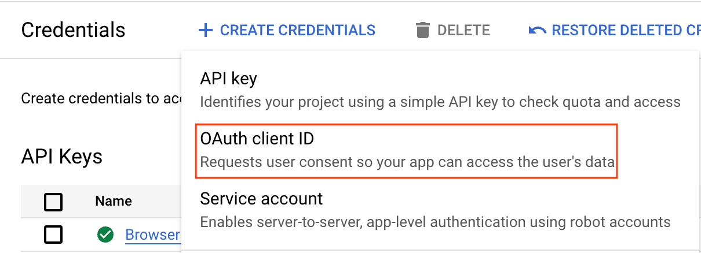
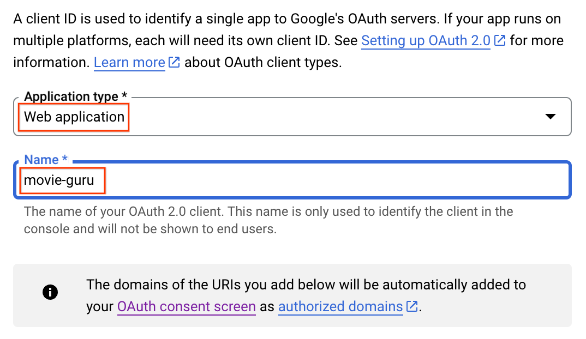
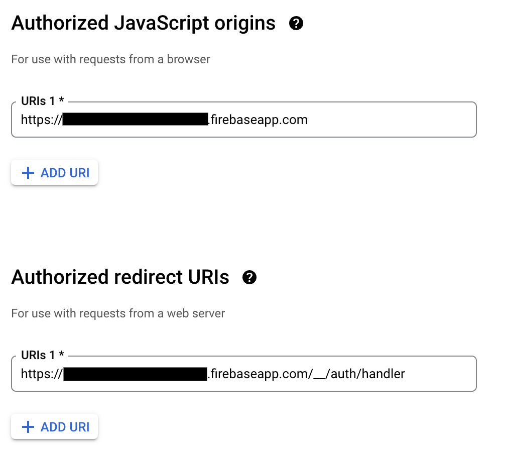
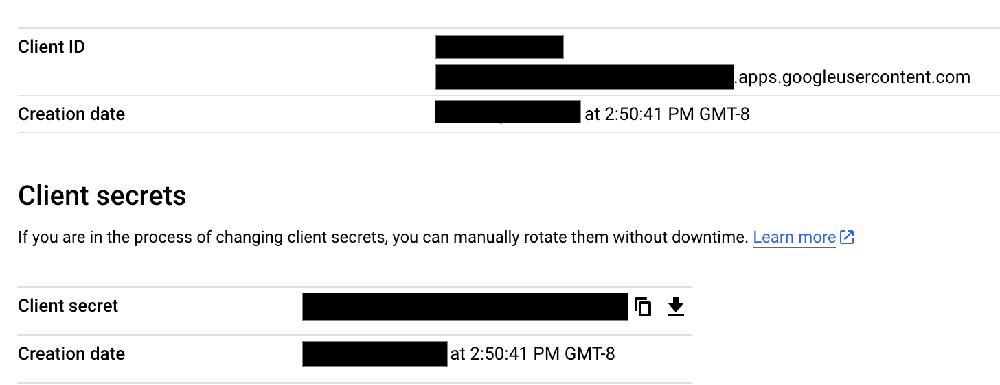
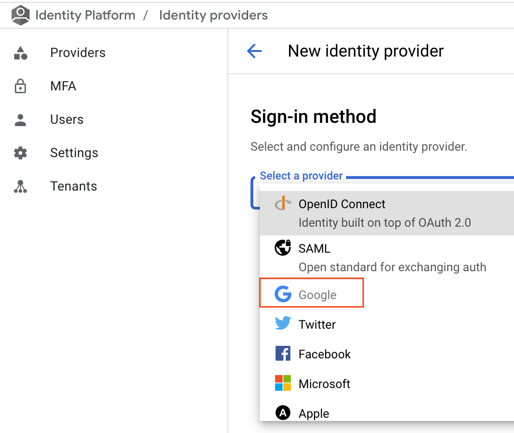
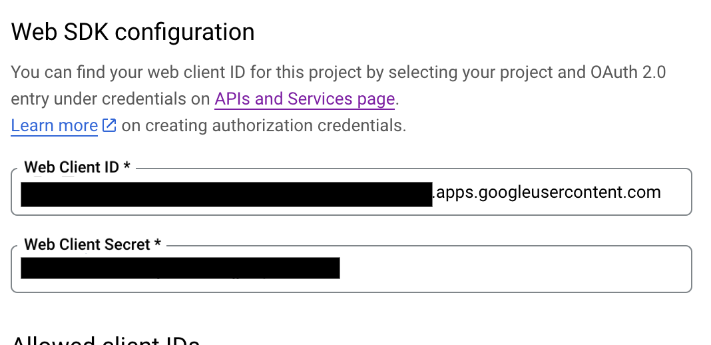
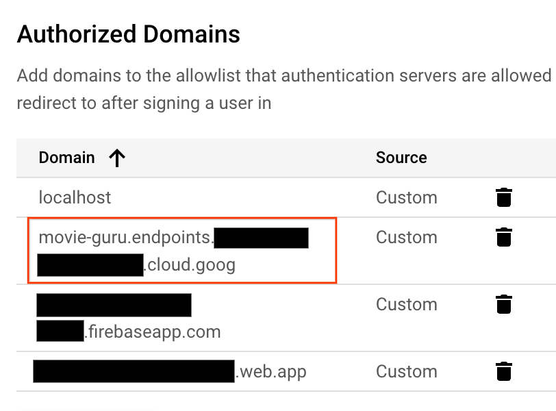

# Firebase Auth Setup

The following steps are necessary for Firebase Auth to work.

## Step 1: Select OAuth Client ID

## Step 2: Create an application

Select `Web Application` and provide an application name

## Step 3: Add authorized URIs and Origin

Replace the redacted portion with your project id

## Step 4: Copy the client id and secret

## Step 5: Create a Google Identity Provider

## Step 6: Paste the Client ID and Secret from Step 4

## Step 7: Add authorized domains

